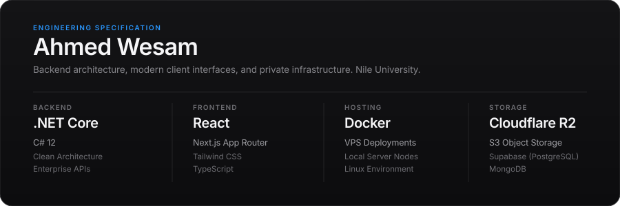

<div align="center">

  <!-- Apple Specification Canvas -->
  

  <br><br>

  <!-- Minimalist Action Bar -->
  <a href="mailto:a.wesam2300@nu.edu.eg">
    
  </a>
  &nbsp;
  <a href="https://www.linkedin.com/in/ahmed-wesam/">
    
  </a>
  &nbsp;
  <a href="https://github.com/AGhaith?tab=repositories">
    
  </a>

</div>

---

### Initiatives

* **Microsoft Learn Student Ambassador** — Technical sessions and workshops covering backend and cloud systems.
* **Google Developer Groups on Campus** — Developer tracks and hands-on materials for Nile University students.
* **Samsung Innovation Campus** — Embedded microcontrollers, sensor telemetry, and hardware integration.

---

### Reference Guides

* **[GitHub Guide](https://github.com/AGhaith/GitHub-Guide)** — Branching workflows, conflict resolution, and repository hygiene.
* **[VS Code Guide](https://github.com/AGhaith/VS-Code-Guide)** — Editor configuration, keybindings, debugger setups, and toolchains.
* **[GDG Sessions](https://github.com/AGhaith/Google-Development-Group)** — Exercise materials and workshop codebases for campus tracks.
* **[Academic Coursework](https://github.com/AGhaith/educational-projects)** — Core data structures and algorithms implementations.

---

### Contact

```text
email    : a.wesam2300@nu.edu.eg
location : Sheikh Zayed, Cairo, Egypt
academic : Nile University (Computer Science)
profile  : linkedin.com/in/ahmed-wesam
```
